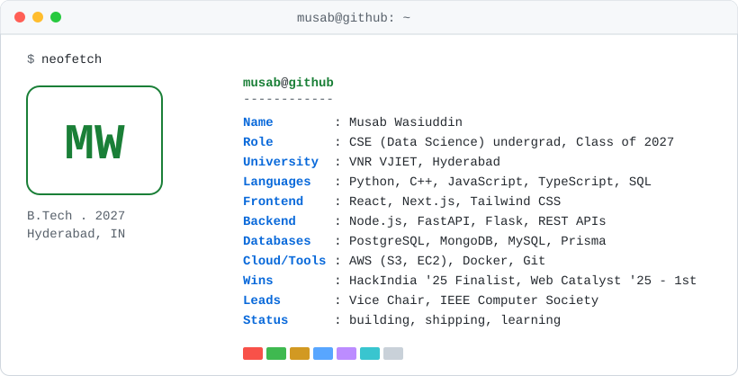
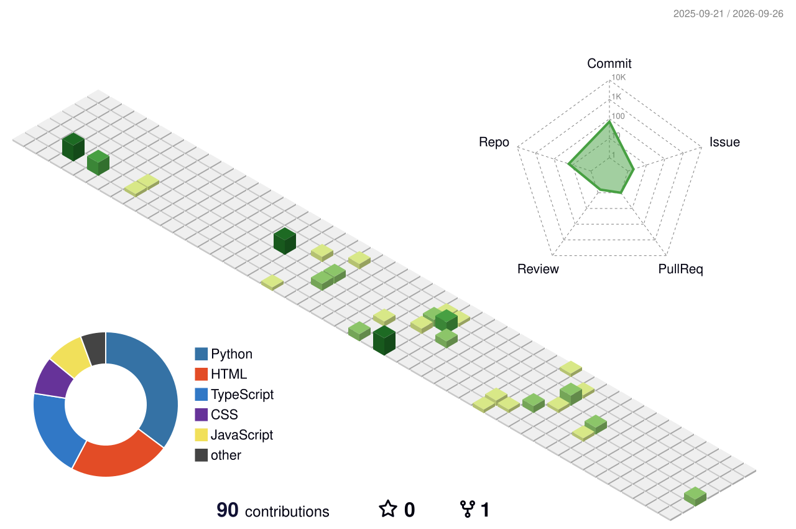

  <picture>
    <source media="(prefers-color-scheme: dark)" srcset="id_badge_dark.svg">
    
  </picture>

  <!-- Replace YOUR-LINKEDIN-HANDLE with your real LinkedIn handle. Add a Portfolio badge here if you have one:
   -->
  
  

---

### 🚀 About Me

I'm a Computer Science & Engineering (Data Science) undergrad at **VNR VJIET, Hyderabad** (Class of 2027). I like turning ideas into full-stack products and data-driven tools that people actually use.

- 🔭 I'm currently building **full-stack platforms with an analytics and ML layer on top.**
- 🌱 I'm constantly learning **scalable backend design, cloud (AWS) and applied AI.**
- 💼 Open for **Software Engineering / Full-Stack / Data roles.**
- 🏆 **Finalist, HackIndia Regionals 2025** (top 40 teams nationwide) · **1st place, Web Catalyst Hackathon 2025**

---

### 🛠️ Tech Stack

| **Languages** | **Frontend** | **Backend & Databases** | **Data** | **Tools & Cloud** |
| :--- | :--- | :--- | :--- | :--- |
|      |     |        |     |     |

---

### 📂 Top Projects

<!-- Turn each project name into a link to its repo or live demo, e.g. **[EventLens](https://github.com/Musab122333/REPO-NAME)** -->

| Project | Description | Tech Stack |
| :--- | :--- | :--- |
| **ERP Companion Platform** | A cross-platform analytics layer that sits on top of existing ERP systems, with role-based dashboards and automated reporting, without modifying the underlying ERP. | `Next.js` `TypeScript` `Node.js` `PostgreSQL` `Prisma` `Recharts` |
| **EventLens** | A cloud-based event photography platform: join events via QR codes, and face recognition builds personalized galleries so nobody sorts photos by hand. | `MongoDB` `Express` `React` `Node.js` `Face Recognition` |
| **Screenshot Manager** | An AI-powered screenshot organizer using OCR-based text extraction and indexing for fast search and categorization across large collections. | `Next.js` `TypeScript` `PostgreSQL` `Prisma` `Tesseract OCR` |

---

### 💼 Experience & Leadership

- **Full-Stack Development Intern** · Uptricks Services Pvt. Ltd. (Mar 2026 – Apr 2026): built a MERN e-commerce platform with authentication, cart and order workflows.
- **Vice Chair** · IEEE Computer Society, VNR VJIET
- **Event Management Head** · VJ ARC Data Science Club

---

### 🏙️ My GitHub City

  <picture>
    <source media="(prefers-color-scheme: dark)" srcset="profile-3d-contrib/profile-night-view.svg">
    
  </picture>

---

*Let's build something interesting!*
